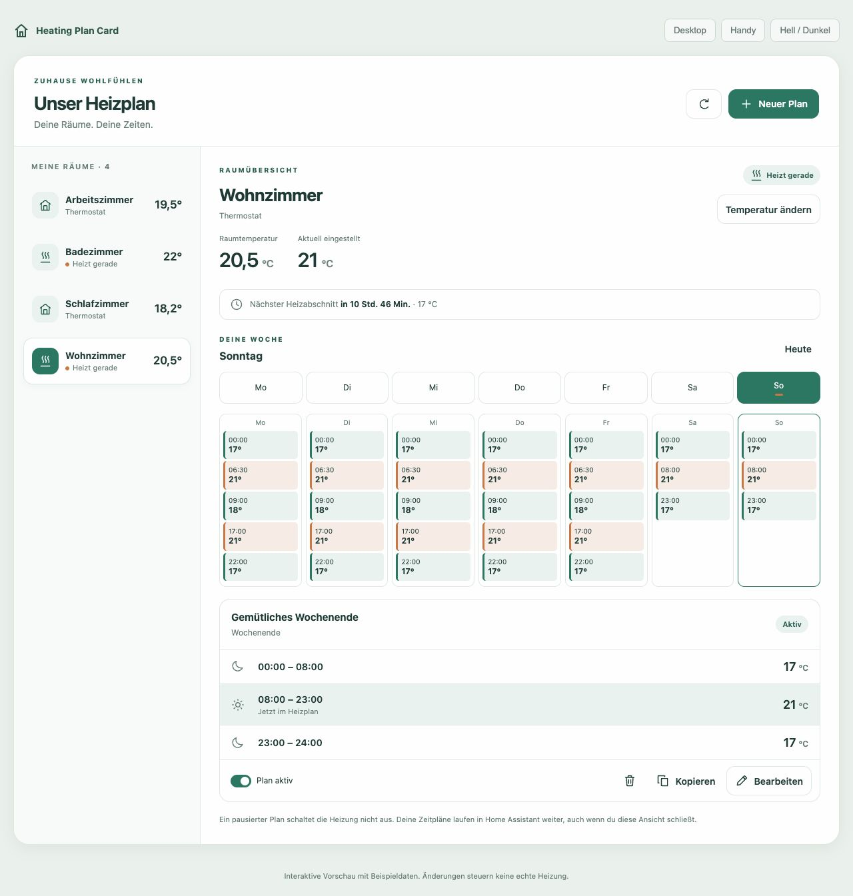

# Heating Plan Card

A heating plan manager for Home Assistant, designed for phones and desktops.
**Heating Plan Card** uses the existing **Scheduler integration** to store and
execute schedules. The interface is written independently using native Web
Components and TypeScript, with no runtime library dependencies.



## Features

- Room overview with actual and target temperature, heating status and upcoming
  transitions for supported fixed-weekday plans.
- Seven-day desktop overview and large day controls on phones.
- Full-screen mobile editor with time inputs, temperature steppers and a pinned
  save button. No dragging of narrow timeline handles is required.
- Create, edit, copy, pause, resume and explicitly delete heating plans.
- Weekday presets plus the Scheduler integration's working-day / non-working-day
  calendar. Calendar rules are preserved, not converted to Monday–Friday.
- Undo the most recent edit while the card remains open, with a fresh conflict
  check before restoring it.
- Detect overlapping active plans and concurrent edits before writing.
- Read back saved schedules before reporting success. Writes are never retried
  automatically after an uncertain network result.
- Respect thermostat limits and temperature step sizes, Home Assistant timezone,
  and light/dark theme colors.
- Change the current target temperature separately from editing the schedule.
- Visual card configuration to choose the thermostats you want to display.

The first version's interface is in **German**. The product name in Home
Assistant and HACS is exactly **Heating Plan Card**.

## Requirements

- Home Assistant 2026.6.0 or newer and a current browser / Companion App webview.
- The [Scheduler integration](https://github.com/nielsfaber/scheduler-component)
  installed and configured. Its `scheduler`, `scheduler/item` and
  `scheduler_updated` WebSocket APIs and `scheduler/add`, `scheduler/edit`,
  `scheduler/remove` REST APIs must be available to the signed-in user.
- Thermostats exposed as `climate` entities. For Better Thermostat, select its
  virtual thermostat entities rather than also selecting the underlying valves.

## Install through HACS

1. Open **HACS → Custom repositories**.
2. Add `https://github.com/leoncode-hacs/heatingplan-card` as **Dashboard**
   (called **Lovelace** in some HACS versions).
3. Download **Heating Plan Card** and fully reload the frontend.
4. Add **Heating Plan Card** to your dashboard through the card picker.
5. In its visual configuration, select your thermostat entities.

The resource is `/hacsfiles/heatingplan-card/heatingplan-card.js`, type
**JavaScript module**. HACS normally registers it automatically.

```yaml
type: custom:heatingplan-card
title: Unser Heizplan
entities:
  - climate.wohnzimmer_thermostat
  - climate.bad_thermostat
```

Omit `entities` to show all thermostats. An empty list intentionally shows none.
For a spacious desktop layout, use a full-width dashboard section. The card
adapts to the available width automatically.

This is a separate repository and uses its own custom-element names. It can be
installed alongside Scheduler Card without replacing its JavaScript files.
Both interfaces operate on the same underlying Scheduler schedules.

## Updates and manual installation

New versioned releases appear as updates in HACS. Install the update there and
reload the frontend. A Home Assistant restart is not needed for a card update.

For manual installation, download `heatingplan-card.js` from
[the latest release](https://github.com/leoncode-hacs/heatingplan-card/releases/latest),
place it in `www/heatingplan-card/`, and register
`/local/heatingplan-card/heatingplan-card.js?v=1.0.0` as a JavaScript module.

Uninstalling the card does not delete your Scheduler schedules. To return to
another interface, remove this card and its resource; the Scheduler integration
continues running. Do not uninstall the Scheduler integration to change cards.

## Existing schedules and editing boundaries

The simple editor supports one thermostat per plan, one `climate.set_temperature`
action per time period, and contiguous full-day periods. It supports explicit
weekdays, daily plans, and a single `workday` or `weekend` rule. The last period
is displayed as ending at 24:00 and is sent as `00:00:00`, as required by Scheduler.

Existing plans with conditions, extra actions or HVAC-mode fields, multiple
thermostats, dates, single executions, time gaps, or unsupported calendar
combinations remain **visible but read-only** in this editor. Their configuration
is never silently simplified. Edit those rules in your existing Scheduler UI.
Their activation switches still control the underlying schedules.

Working-day calendar plans are listed separately because a fixed seven-column
week cannot accurately predict holidays from the current Workday sensor alone.
Temperature changes outside this card, window detection and other automations
can also affect the actual target. The displayed plan is not a guarantee that
no other controller will change the thermostat.

Creating or changing an active plan can immediately apply its current time
period. Pausing or deleting a plan does **not** turn off the heating; the last
set target remains. A direct temperature change is not a timed override and can
be superseded by the next schedule action. Timed boosts are intentionally not
implemented with browser timers.

Conflict checks are conservative, especially when mixing concrete weekdays and
working-day rules. The backend does not provide atomic compare-and-swap, so two
clients can still race between the final read and a write. Prefer one active
heating plan per thermostat and applicable day.

## Development

```sh
npm ci
npm run check
npm run dev
```

Open `http://127.0.0.1:4173` for an interactive demo. It uses in-memory example
data; no credentials or real Home Assistant connection are involved.

Tests cover data conversion, schedule safety, timezone handling, API writes and
readback, DOM editing, undo, deletion confirmation, lifecycle cleanup and label
escaping. Browser verification covers desktop and phone layouts. Actual
installation and real-device behavior need to be verified in the target Home
Assistant instance; automated fixtures are not a real heating test.

## Releases

Update `package.json` and its lockfile, write `RELEASE_NOTES.md`, run
`npm run check`, and commit the source plus `dist/heatingplan-card.js`. Push a
matching `vMAJOR.MINOR.PATCH` tag. The Release workflow checks the exact tag,
builds and tests, then publishes the JavaScript asset and SHA-256 checksums.
A manual **Actions → Release → Run workflow** entry point accepts an existing
tag if a push event was missed. Published versions must not be reused.

## License and provenance

**GNU General Public License v3.0 only (`GPL-3.0-only`).** See [LICENSE](LICENSE).

This is an independently authored project, not a fork of Scheduler Card. No
source files, assets, components or styles from that repository are included.
The separate Scheduler integration is used through its APIs and is not bundled.
Build and test tools retain their respective licenses and are not distributed
inside the runtime bundle. See [PROVENANCE.md](PROVENANCE.md) for details.
